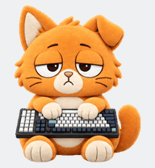
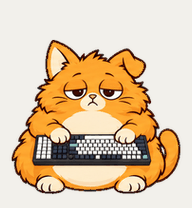

# Catnap Pets

Two sleepy orange cats with tiny keyboards: **Plush Catnap** and **Chonky Catnap**. Each has nine animated states and sixteen head-and-eye gaze poses for the ChatGPT Pets v2 format.

| Plush Catnap | Chonky Catnap |
| --- | --- |
|  |  |
| Soft plush texture, oversized sleepy head. | Round cartoon body, tiny tired head. |
| [Browse files](pets/plush-catnap/README.md) · [Upload PNG](pets/plush-catnap/spritesheet.png) · [All states](pets/plush-catnap/previews/all-states.gif) | [Browse files](pets/chonky-catnap/README.md) · [Upload PNG](pets/chonky-catnap/spritesheet.png) · [All states](pets/chonky-catnap/previews/all-states.gif) |

## Upload a cat

1. Download this repository, or save the original `spritesheet.png` from the cat's folder. On GitHub, use the file's raw download control to save the PNG itself.
2. Open [ChatGPT Pets settings](https://chatgpt.com/settings/pets) while signed in.
3. Choose **Upload pet**, select the PNG, and use the corresponding name: **Plush Catnap** or **Chonky Catnap**.
4. Save the pet and select it from your collection.

Use the full sprite sheet. `design.png`, contact sheets, GIFs and videos are viewing or editing references.

These original files passed the Pets v2 preflight at **1536 × 2288**. The [official Pets documentation](https://learn.chatgpt.com/docs/pets) currently describes a **1536 × 1872** web upload sheet. If your upload interface requires that nine-row size, it does not match these eleven-row v2 masters; preserve the originals rather than resizing them. Availability and upload controls can vary by interface.

## What's included

```text
pets/
  plush-catnap/
  chonky-catnap/
    spritesheet.png       final upload asset
    design.png            approved character design
    previews/             GIF, WebP, MP4 and four-state stills
    sources/              selected strips, prompts and source manifests
    qa/                   preserved validation reports and visual evidence
manifest.json             final artifact names, sizes and SHA-256 hashes
SHA256SUMS                 checksums for repository content
qa/                       packaging checks and browser smoke-test notes
SOURCES.md                 source selection and editing constraints
```

Both cat folders have the same structure. [Source notes](SOURCES.md) explain the selected materials and keyboard orientation. [QA notes](qa/README.md) distinguish saved production checks, browser evidence and packaging verification.

## Sprite format

Both upload assets are transparent RGBA PNGs with **8 columns × 11 rows**, **192 × 208 pixels per cell**, and **73 populated poses**. Unused cells remain transparent. Row numbers below start at zero; frames run left to right.

| Row | State name | Frames | Behavior |
| --- | --- | ---: | --- |
| 0 | `idle` | 6 | Sleepy breathing and blinking |
| 1 | `running-right` | 8 | Walk or waddle to the right |
| 2 | `running-left` | 8 | Walk or waddle to the left |
| 3 | `waving` | 4 | Tired paw wave |
| 4 | `jumping` | 5 | Lift and landing |
| 5 | `failed` | 8 | Forehead slump onto the keyboard |
| 6 | `waiting` | 6 | Expectant pause |
| 7 | `running` | 6 | Active work: seated keyboard typing |
| 8 | `review` | 6 | Inspecting completed work |
| 9 | `look-row-9` | 8 | 0°, 22.5°, 45°, 67.5°, 90°, 112.5°, 135°, 157.5° |
| 10 | `look-row-10` | 8 | 180°, 202.5°, 225°, 247.5°, 270°, 292.5°, 315°, 337.5° |

The gaze sequence runs clockwise from **up (0°)** through **screen-right (90°)**, **down (180°)** and **screen-left (270°)**. The head and eyes move while the seated body and keyboard stay anchored.

PNG and the transparent WebP previews preserve soft alpha edges. GIF and MP4 previews are composited against a neutral background for clean viewing; they are not upload masters. Source strips can still have chroma-key backgrounds because they precede extraction and cleanup.

## Validation and limits

The saved reports record passing structure, frame, quality, independent direction and Pets preflight checks for both cats. Both final PNG hashes match the approved assets in [manifest.json](manifest.json). Three independent direction reviewers passed the main cardinal gates. Some intermediate gazes are subtle, especially the downward component near horizontal; the original warnings and their visual review remain in each cat's QA folder.

The Firefox smoke test confirmed both named pets render with multiple animated idle poses in the collection, and that selecting Chonky then returning to Plush works. **Full live task-driven states and gaze tracking remain unverified.** See the [runtime note](qa/runtime-smoke-test.md) for the exact scope and limitation.

The [packaging report](qa/packaging-verification.json) records local integrity and decode checks. To recheck the file checksums from the repository root on macOS or Linux:

```sh
shasum -a 256 -c SHA256SUMS
```
