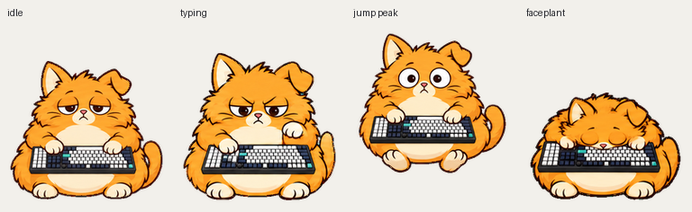

# Chonky Catnap

An absurdly round sleepy orange cat who dozes at a keyboard and types with sudden seriousness.

[Upload spritesheet](spritesheet.png) · [Approved design](design.png) · [All-state GIF](previews/all-states.gif) · [All-state MP4](previews/all-states.mp4) · [Gaze loop](previews/look-loop.webp) · [Idle–jump–idle](previews/idle-jump-idle.webp)

- [Previews](previews/) — all nine states as GIF and transparent WebP, plus combined previews.
- [Sources](sources/) — completed strips, prompts, guides and sanitized production records.
- [QA](qa/) — final contact sheet, direction sheet, original validation reports and alpha review evidence.

The upload PNG is 1536 × 2288, RGBA, Pets v2, with 73 populated poses. Its original SHA-256 is `840abe5f17bf9dcba9b0112086faad3629a1576e19d91cd14ea1a698e436cbaa`.

[Upload instructions and layout](../../README.md) · [Editing constraints](../../SOURCES.md) · [Validation scope](../../qa/README.md)
